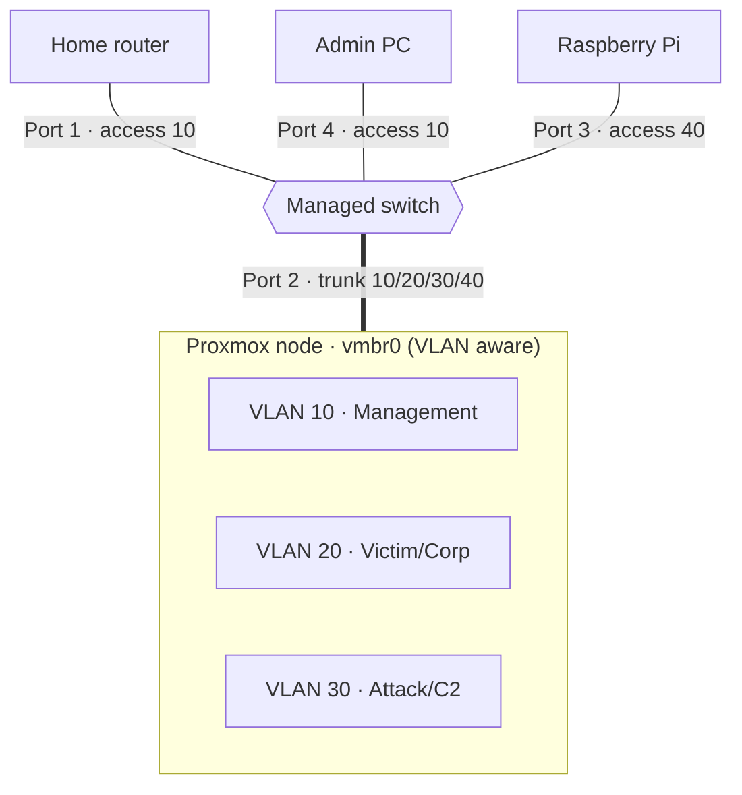

## VLAN Topology

| VLAN ID | Name        | Security Level | Purpose                                   |
| ------- | ----------- | -------------- | ----------------------------------------- |
| **10**  | Management  | High           | Proxmox GUI, Switch UI, Admin PC          |
| **20**  | Victim/Corp | Low            | Active Directory, Windows Targets         |
| **30**  | Attack/C2   | Restricted     | Kali Linux, Sliver C2, Exploitation Tools |
| **40**  | IoT/Lab     | Medium         | Raspberry Pi, Vulnerable Hardware         |



## Port Mapping & PVID

| Physical Port | Device       | Mode      | PVID | Allowed VLANs  |
| ------------- | ------------ | --------- | ---- | -------------- |
| **Port 1**    | Home Router  | Access    | 10   | 10             |
| **Port 2**    | Proxmox Node | **Trunk** | 10   | 10, 20, 30, 40 |
| **Port 3**    | Raspberry Pi | Access    | 40   | 40             |
| **Port 4**    | Admin PC     | Access    | 10   | 10             |

Configured as advanced VLAN in management portal
note: 
- tagged - 1 port to many VLANs - header to identify traffic membership
- untagged - 1 port to 1 VLAN

to show VLANs from proxmox run ```bridge vlan show``` 
